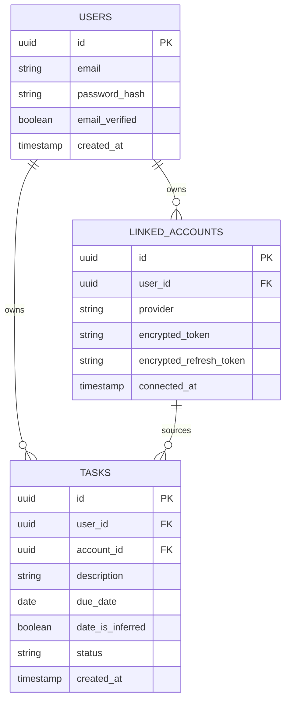
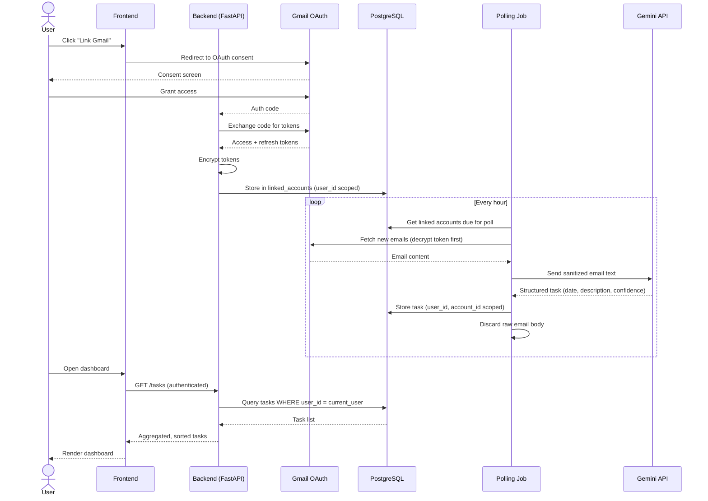

# Phase 0 — Planning & Design

AI Email Task Extractor — pre-build planning doc. Companion to `architecture-roadmap.md`.

---

## 1. User Stories

### Auth & account
- As a user, I can sign up with email and password so I have a private account.
- As a user, I can log in and log out so my session is secure.
- As a user, I want my password stored as a secure hash (never plaintext) so a database breach doesn't expose my credentials.
- As a user, I want my login session to expire and refresh safely so a stolen token can't be used indefinitely.
- As a user, I want failed login attempts rate-limited so attackers can't brute-force my password.
- As a user, I want to verify my email before linking any external account, so a fake signup can't be used to hijack real inboxes.
- As a user, I want the option to enable 2FA so my account is protected even if my password leaks.

### Linking accounts
- As a user, I can link a Gmail account via OAuth so the app can read my emails.
- As a user, I can see which accounts I've linked so I know what's being monitored.
- As a user, I can unlink an account so the app stops accessing it and its data.
- As a user, I can link multiple accounts (Gmail, Outlook, Yahoo) so all my emails feed one dashboard.
- As a user, I want my OAuth tokens encrypted at rest so no one with database access can read my Gmail without also having the encryption key.
- As a user, I want the app to request only the minimum email permissions it needs, so a compromise doesn't expose my entire mailbox.
- As a user, I want unlinking an account to immediately revoke its access with the provider, not just remove it from the app's database.

### Extraction
- As a user, I want the app to automatically scan new emails for deadlines/tasks so I don't have to read every email manually.
- As a user, I want extracted tasks to include a date and description so I know what's due and when.
- As a user, I want to know if a due date was ambiguous or inferred, so I don't blindly trust a wrong deadline.
- As a user, I want the app to treat email content as untrusted input when sending it to the AI, so a malicious email can't manipulate the extraction process.
- As a user, I want my email content excluded from plaintext logs, so a log leak doesn't expose my private messages.
- As a user, I want raw email content discarded after task extraction so less of my personal data is retained than necessary.

### Dashboard
- As a user, I can view all my tasks in one place, aggregated across every linked account.
- As a user, I can sort tasks by due date so I see what's most urgent first.
- As a user, I can see which account/email a task came from so I can go verify it if needed.
- As a user, I can mark a task as done or dismiss it so my list stays relevant.

### Data isolation
- As a user, I trust that only I can see my tasks and linked accounts — never another user's data.
- As a user, I want every part of the system to enforce that only I can see my own data, so no bug leaks it to anyone else.
- As a user, I want the system to identify me only from my authenticated session, so no request I send can be tampered with to act as another user.

### Backend & infra (maintainer-facing)
- As a maintainer, I want all input validated and sanitized so malformed or malicious data can't corrupt the app.
- As a maintainer, I want HTTPS enforced everywhere so data can't be intercepted in transit.
- As a maintainer, I want API keys kept backend-only so they can't be extracted from the browser.
- As a maintainer, I want dependencies scanned for known vulnerabilities so the app isn't exposed by an unpatched library.
- As a maintainer, I want encrypted backups so data is recoverable but not exposed if a backup is stolen.
- As a maintainer, I want alerts on anomalies like failed-login spikes so I can respond to an attack before it escalates.

### Mobile
- As a user, I can open the same dashboard on my phone via the React Native app, with no separate login or data.

---

## 2. MVP Scope

### In (v1)
- Email/password auth, email verification, password hashing, session tokens, login rate limiting
- Gmail linking only (OAuth, minimum scope, encrypted token storage)
- Unlink account (with provider token revocation)
- Hourly polling job for linked Gmail accounts
- Gemini extraction → task (date, description, source account) with ambiguity flag
- Raw email body discarded after extraction; no email content in logs
- Task dashboard: aggregated list, sort by due date, mark done, dismiss
- User-scoped data access on every endpoint + DB-level row security
- HTTPS, secure cookies, CORS lock, backend-only secrets, parameterized queries
- Pinned dependencies, `.env` gitignored

### Out (later phases)
- Outlook / Yahoo linking (Phase 6)
- 2FA (fast-follow, not v1-blocking)
- Manual add/edit task
- Filter by account/status (beyond basic sort)
- Anime.js polish (nice-to-have, not blocking)
- Anomaly alerting / monitoring dashboards
- Mobile app (Phase 7)
- Deployment/containerization polish (Phase 8) — local/dev-mode is fine for MVP validation

---

## 3. ERD



---

## 4. Sequence Flow — OAuth Linking, Polling, Extraction



---

## 5. API Contract (MVP)

| Method | Endpoint | Auth | Request | Response | Notes |
|---|---|---|---|---|---|
| POST | `/auth/signup` | none | `{email, password}` | `{user_id}` | Triggers verification email |
| POST | `/auth/verify` | none | `{token}` | `{verified: true}` | Marks email_verified |
| POST | `/auth/login` | none | `{email, password}` | `{access_token, refresh_token}` | Rate-limited |
| POST | `/auth/refresh` | refresh token | `{refresh_token}` | `{access_token}` | |
| POST | `/auth/logout` | session | — | `{ok: true}` | Invalidates session |
| GET | `/accounts` | session | — | `[{id, provider, connected_at}]` | User-scoped |
| GET | `/accounts/gmail/link` | session | — | redirect URL | Starts OAuth |
| GET | `/accounts/gmail/callback` | session | `{code}` | `{ok: true}` | Exchanges + stores token |
| DELETE | `/accounts/{id}` | session | — | `{ok: true}` | Revokes token w/ provider, then deletes |
| GET | `/tasks` | session | query: `sort`, `status` | `[{id, description, due_date, date_is_inferred, account_id, status}]` | User-scoped |
| PATCH | `/tasks/{id}` | session | `{status}` | `{ok: true}` | Mark done/dismissed |

---

## 6. Wireframe (low-fi)

**Login screen**
```
+--------------------------------+
|         [App name]              |
|  Email    [______________]      |
|  Password [______________]      |
|            [ Log in ]           |
|         Sign up instead?        |
+--------------------------------+
```

**Dashboard**
```
+----------------------------------------------------+
| [App name]                     [+ Link account] [⋯] |
+----------------------------------------------------+
| Linked: Gmail (you@gmail.com)                        |
+----------------------------------------------------+
| Sort: [Due date v]     Filter: [All accounts v]      |
+----------------------------------------------------+
| [ ] Submit report draft        Due: Aug 20  (Gmail)  |
| [ ] Reply to vendor contract    Due: Aug 22* (Gmail)  |
| [x] Pay invoice #2291           Done                  |
+----------------------------------------------------+
   * = inferred date, low confidence
```

---

## 7. Risk / Assumptions Log

| Risk / Assumption | Impact | Mitigation |
|---|---|---|
| Gemini free tier rate limits may throttle polling frequency | Delayed task extraction at scale | Start with hourly polling; add backoff/queueing before adding more providers |
| Yahoo OAuth docs are sparser than Gmail's | Phase 6 slower than estimated | Budget extra time; consider deprioritizing Yahoo if adoption is low |
| Email content sent to a third-party AI API (Gemini) | Privacy exposure if mishandled | Sanitize input, discard raw body post-extraction, never log content |
| AI misreads ambiguous dates ("next week") | Wrong deadlines shown to user | Ship confidence/ambiguity flag in v1, not as a fast-follow |
| Single encryption key for OAuth tokens | Key compromise exposes all tokens | Design for key rotation from day one, store key outside the DB |
| Solo dev, limited time for security review | Vulnerabilities slip through | Automate what's automatable: dependency scanning, static analysis (bandit), row-level security as a second enforcement layer |
| Polling job silently fails (expired token, provider outage) | Users miss tasks with no visibility | Add retry + surface a "last synced" timestamp in the UI, even in MVP |

---

## 8. Feature / Story → Risk Cross-Reference

| Feature or story | Risk it introduces or is exposed to | Mitigation status |
|---|---|---|
| Gemini extraction + ambiguity flag | AI misreads ambiguous dates → wrong deadline shown | Mitigated in MVP (flag shipped, not deferred) |
| Hourly polling of Gmail | Gemini/Gmail rate limits throttle polling; silent job failures | Partially mitigated — add "last synced" timestamp + retry in MVP |
| Sending email content to Gemini | Third-party exposure of private content; prompt injection | Mitigated by sanitization + no-log + discard-after-extraction, but prompt-injection defenses are inherently incomplete — **residual risk, not zero risk** |
| Encrypted OAuth token storage | Single key compromise exposes all tokens | Designed for rotation in MVP — **must be exercised once in staging before launch**, not just coded |
| Optional 2FA | Low real-world adoption if off by default → protection doesn't reach the accounts that need it | Open decision: nudge/encourage at signup, not just bury in settings |
| Row-level security (DB layer) | Silent misconfiguration gives false confidence (missing on one table, bypassed by superuser conn) | Needs an explicit test: attempt cross-user read with a non-superuser role and confirm it's blocked |
| CORS restricted to frontend origin | Easy to leave permissive during dev, forget to lock down pre-launch | Add to pre-deploy checklist |
| Anomaly alerting (failed-login spikes) | Easy to skip entirely as a solo dev since nothing blocks shipping without it | Move from "nice to have" to MVP-blocking, since it's what detects abuse of the rate limiter |
| Manual add/edit task (future) | Could bypass the same user-scoping path as AI-extracted tasks if built as a separate "quick add" endpoint | Note for future: must reuse the same scoped repository/query layer, no shortcuts |
| Mobile app, "no backend changes needed" | Optimistic — Gmail OAuth on iOS often needs different redirect handling or a native SDK | Treat as an assumption to verify in Phase 7 planning, not a guarantee |
| Solo dev + large security feature surface in MVP | Underestimated effort; security work competes with product work for the same hours | Sequence security items first per phase (see below), not bolted on at the end |

**Sequencing suggestion**: within each phase, build the security requirement *before* the feature it protects, not after — e.g. build user-scoped query enforcement before the first `/tasks` endpoint exists, not as a retrofit once tasks are already returning data.

---

## 9. Pre-Launch Security Checklist

A closing pass to confirm nothing from the risk table above is left as just a "design intention." Run through this before considering MVP done:

- [ ] Passwords hashed with bcrypt/argon2 — verified with a test that plaintext is never in the DB
- [ ] Login rate limiting actually triggers under a scripted brute-force test
- [ ] Email verification blocks account linking until confirmed
- [ ] OAuth scope requested is read-only, confirmed via the actual consent screen (not just the code request)
- [ ] Token encryption key stored outside the DB (env var / secrets manager), and rotation has been exercised at least once in staging
- [ ] Unlink triggers the provider's token revocation endpoint — confirmed via provider API, not just a local delete
- [ ] Every `/tasks` and `/accounts` query tested to confirm it's scoped to `user_id` — attempt a cross-user fetch with a second test account and confirm it 403s/empty-results
- [ ] Row-level security policy exists on every user-scoped table, tested with a non-superuser DB role
- [ ] All endpoints reject a `user_id` passed in the request body/params in favor of the session-derived one
- [ ] HTTPS enforced in staging and prod (not just "planned")
- [ ] Cookies set with `Secure`, `HttpOnly`, `SameSite=Strict`
- [ ] CORS allowlist contains only the real frontend origin — no wildcard, no leftover dev origins
- [ ] API keys (Gemini, OAuth client secrets) confirmed absent from any frontend bundle (grep the built JS)
- [ ] Email content confirmed absent from logs — grep log output after a test extraction run
- [ ] Raw email body confirmed deleted post-extraction (check DB row after a test run)
- [ ] `.env` and secrets confirmed in `.gitignore`, and git history checked for accidental commits
- [ ] `pip-audit` / `npm audit` run clean (or flagged issues triaged) before deploy
- [ ] Database backups encrypted, and a restore has been test-run at least once
- [ ] Basic alerting in place for failed-login spikes (even a simple threshold + email is enough for MVP)

If every box above is checked, the security surface committed to in MVP scope is actually built, not just described — that's the gap this checklist exists to catch for a solo dev under time pressure.

---

*Habits carried over from the roadmap: write the user story before coding, sketch the schema before backend code, build in small testable chunks, commit meaningfully.*
